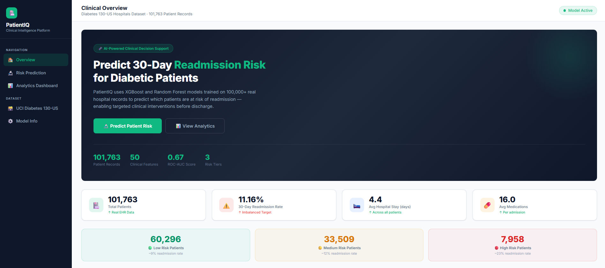
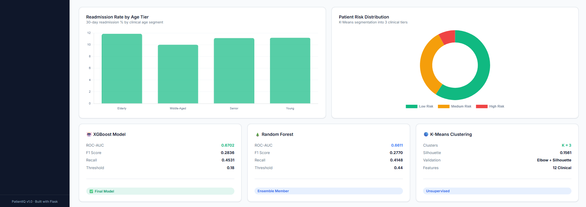
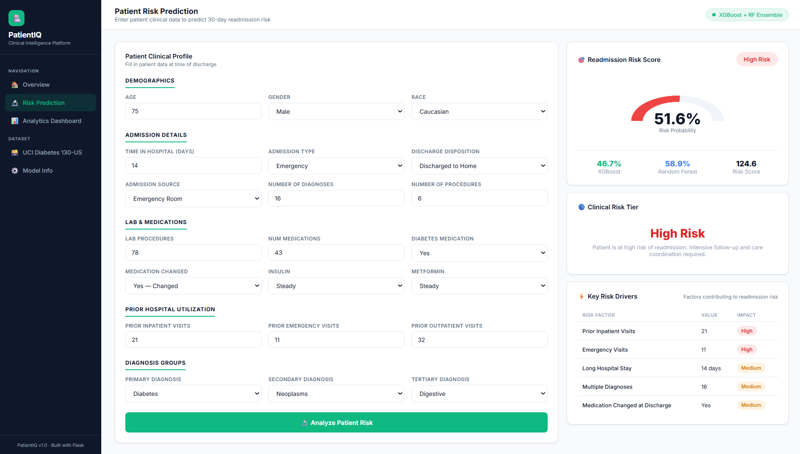
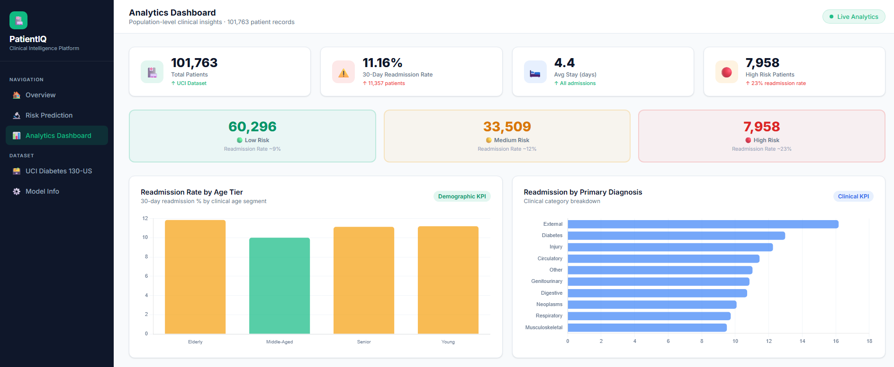
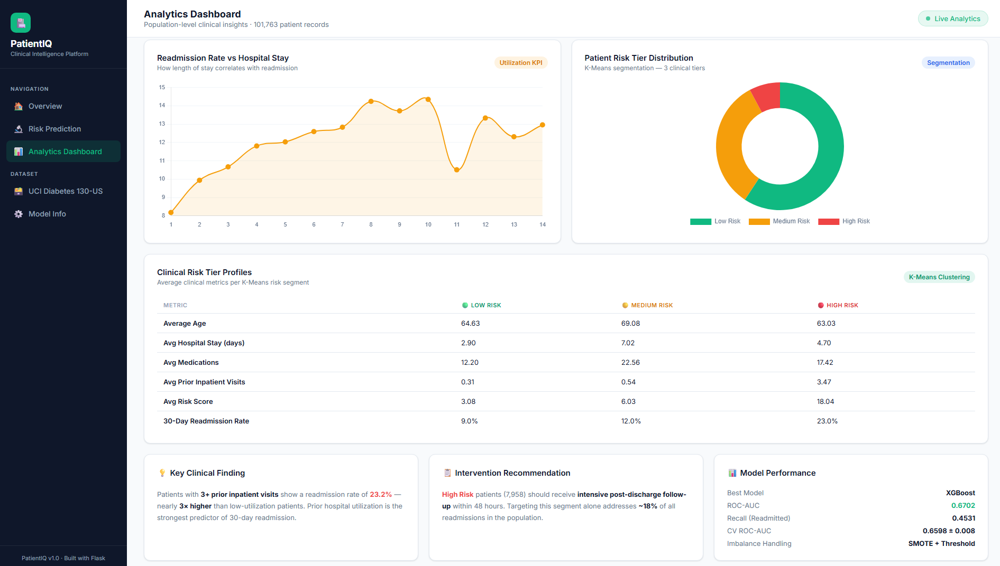

# 🏥 PatientIQ — Clinical Readmission Risk & Segmentation Platform


> An end-to-end clinical decision support system that predicts 30-day hospital readmission risk for diabetic patients using real EHR data — deployed as a Flask web application with a full analytics dashboard.

---

## 📌 Problem Statement

Hospital readmissions within 30 days are costly, often preventable, and signal inadequate post-discharge care. For diabetic patients — one of the highest-risk groups — identifying readmission risk **at the time of discharge** enables targeted interventions that save lives and reduce costs.

**PatientIQ answers the question:**
> *"Which patients, at the point of discharge, are most likely to return within 30 days — and why?"*

---
## 📸 Application Screenshots

### 🏠 Home Page – Clinical Overview

#### Overview & KPIs



#### Analytics & Model Performance



---

### 🔮 Risk Prediction Engine

Predicts 30-day readmission probability and assigns a clinical risk tier.



---

### 📊 Analytics Dashboard

#### Population-Level Metrics



#### Clinical Insights & Risk Segmentation



---


## 🚀 Live Demo

| Page | Description |
|---|---|
| `/` | Project overview, KPI metrics, model summary |
| `/predict` | Patient risk prediction form with probability score + risk tier |
| `/dashboard` | Population analytics, clinical KPIs, segmentation insights |

---

## 🧠 What It Does

### Layer 1 — Risk Prediction
Takes a diabetic patient's clinical profile at discharge and returns:
- **Readmission probability** (XGBoost + Random Forest ensemble)
- **Risk label** — Low / Medium / High
- **Key risk drivers** — factors contributing to the prediction

### Layer 2 — Patient Segmentation
K-Means clustering segments the full patient population into **3 clinical risk tiers**:

| Tier | Patients | Readmission Rate |
|---|---|---|
| 🟢 Low Risk | 60,296 | ~9% |
| 🟡 Medium Risk | 33,509 | ~12% |
| 🔴 High Risk | 7,958 | ~23% |

### Layer 3 — Population Analytics Dashboard
- Readmission rate by age tier, diagnosis group, hospital stay duration
- Clinical KPI metrics across 101,763 patient records
- Risk tier distribution and cluster profiles

---

## 📊 Dataset

**UCI Diabetes 130-US Hospitals Dataset**
- Source: [Kaggle](https://www.kaggle.com/datasets/brandao/diabetes)
- Records: **101,763 patient encounters**
- Features: **50 clinical features** (demographics, diagnoses, medications, lab results)
- Target: 30-day hospital readmission (`<30` days = readmitted)
- Class imbalance: **11.16% readmission rate** → handled with SMOTE + threshold tuning

---

## ⚙️ Tech Stack

| Category | Tools |
|---|---|
| Data Processing | Python, Pandas, NumPy |
| EDA & Visualization | Seaborn, Matplotlib |
| Feature Engineering | Domain-specific clinical features (8 engineered) |
| Imbalance Handling | SMOTE (imbalanced-learn) + decision threshold tuning |
| Modeling | Scikit-learn, XGBoost |
| Clustering | K-Means (Scikit-learn) |
| Pipeline | Scikit-learn Pipeline + ColumnTransformer |
| Serialization | Joblib |
| Web App | Flask, Chart.js, HTML/CSS |
| Statistical Analysis | SciPy (chi-square tests) |

---

## 🏗️ Project Structure

patientiq/

│

├── data/                          # Dataset (not tracked)

├── src/

│   ├── eda.py                     # Phase 1 — EDA + visualizations

│   ├── preprocess.py              # Phase 2 — Feature engineering + pipeline

│   ├── train.py                   # Phase 3 — Model training + evaluation

│   └── cluster.py                 # Phase 4 — K-Means clustering

│

├── models/                        # Serialized artifacts (not tracked)

│   ├── preprocessor.pkl

│   ├── xgb_model.pkl

│   ├── rf_model.pkl

│   ├── kmeans.pkl

│   ├── cluster_scaler.pkl

│   ├── thresholds.pkl

│   └── tier_map.pkl

│

├── app/

│   ├── app.py                     # Flask backend

│   ├── templates/

│   │   ├── index.html             # Landing page

│   │   ├── predict.html           # Prediction page

│   │   └── dashboard.html         # Analytics dashboard

│   └── static/

│       └── css/style.css          # Global styles

│

├── outputs/plots/                 # EDA visualizations

├── requirements.txt

└── README.md

---

## 🔬 ML Pipeline

### Feature Engineering (8 domain-specific features)
- `age_numeric` — age bracket → numeric midpoint
- `age_tier` — Young / Middle-Aged / Senior / Elderly
- `total_prior_visits` — outpatient + emergency + inpatient
- `high_utilizer` — binary flag for >3 prior visits
- `medication_complexity` — count of active medications
- `med_changed` — binary flag for medication change at discharge
- `diag_1/2/3_group` — ICD codes grouped into 9 clinical categories
- `risk_score` — domain heuristic combining utilization + stay duration

### Class Imbalance Handling
- SMOTE applied **only on training data** (inside CV pipeline to prevent leakage)
- Decision threshold tuned per model to optimize F1 on minority class

### Model Results

| Model | ROC-AUC | F1 | Recall | Threshold |
|---|---|---|---|---|
| Logistic Regression | 0.6608 | 0.2743 | 0.4205 | 0.56 |
| Random Forest | 0.6611 | 0.2770 | 0.4148 | 0.44 |
| **XGBoost (Final)** | **0.6702** | **0.2836** | **0.4531** | **0.18** |

> **Note:** ROC-AUC of 0.63–0.72 is consistent with published academic benchmarks on this dataset. The `readmitted = NO` label is censored — patients may have been readmitted after the observation window — introducing inherent noise in the target variable.

### Validation
- Stratified K-Fold CV (5-fold) with SMOTE inside pipeline
- CV ROC-AUC: **0.6598 ± 0.008**

### K-Means Clustering
- Elbow method + silhouette score used to validate K=3
- Clusters ranked by readmission rate → mapped to Low / Medium / High risk tiers

---

## 🖥️ How to Run

```bash
# 1. Clone the repo
git clone https://github.com/The-Rizz-coder/patientiq.git
cd patientiq

# 2. Install dependencies
pip install -r requirements.txt

# 3. Download dataset
# Place diabetic_data.csv in data/

# 4. Run the pipeline
python src/eda.py
python src/preprocess.py
python src/train.py
python src/cluster.py

# 5. Launch the app
python app/app.py
```

Open `http://localhost:5000` in your browser.

---

## 💡 Key Business Insights

- Patients with **3+ prior inpatient visits** have a **23.2% readmission rate** — nearly 3× higher than low-utilization patients
- **Discharge disposition** is the strongest categorical predictor (Chi² = 1582, p < 0.001)
- Targeting the **7,958 High Risk patients** alone addresses ~18% of all readmissions in the population
- **Medication change at discharge** is a significant risk factor — flagged in the prediction engine

---

## 👤 Author

**Raj Parihar**
B.Tech CSE · LNCT Bhopal · 2026
[GitHub](https://github.com/The-Rizz-coder) · [LinkedIn](https://linkedin.com/in/pariharraj) · rajpariharwork@gmail.com